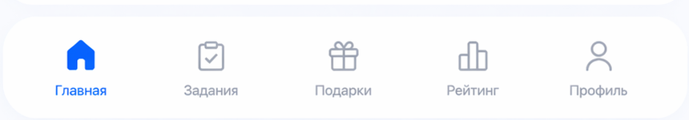
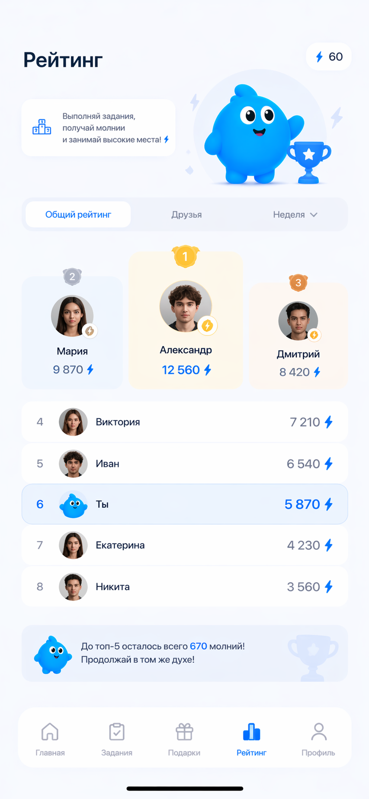
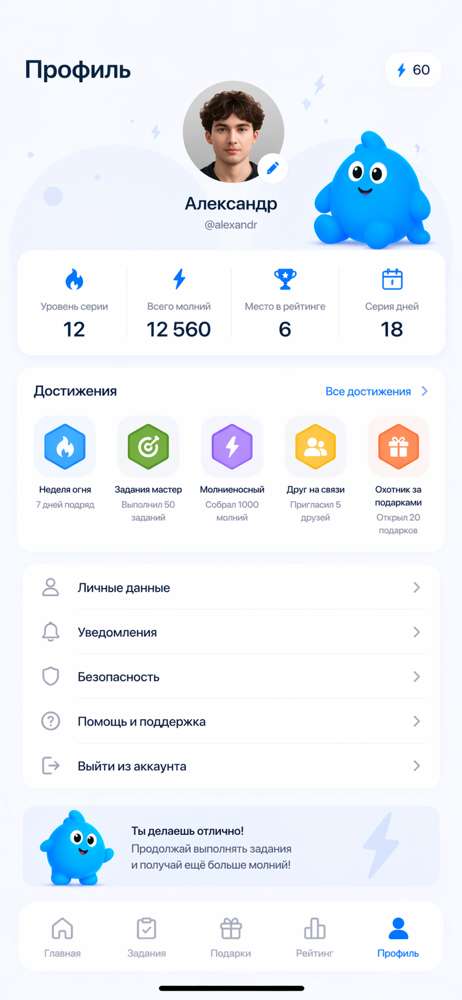
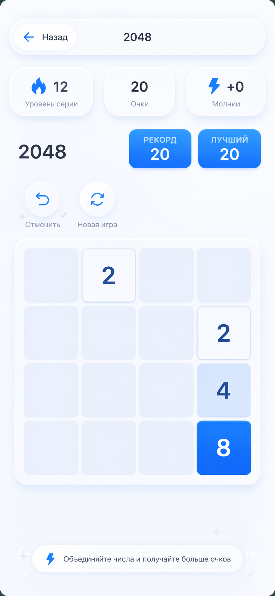

# Документация веб-приложения «Мобик»

## 1. Описание проекта

«Мобик» — интегрированное mobile-first решение для молодого клиента МТБанка в возрасте до 25 лет.  
Продукт объединяет инновационный пакет банковских услуг, ежедневные игровые механики и вирусную онлайн-игру в единую цифровую экосистему.

В основе концепции лежит ТЗ: разработать решение, которое не просто показывает банковские сервисы, а превращает взаимодействие с ними в вовлекающий и социально распространяемый опыт. Поэтому банковские действия, прогресс пользователя, награды, друзья и мини-игры связаны между собой в одном интерфейсе.

«Мобик» — это мобильное веб-приложение в формате игровой экосистемы для пользователей МТБанка.  
Продукт объединяет:

- главную витрину с персонажем Мобиком;
- пакет мотивирующих банковских сценариев для молодой аудитории;
- систему активности и уровня серии;
- разделы «Задания», «Подарки», «Рейтинг», «Профиль»;
- набор мини-игр внутри единого интерфейса;
- вирусный игровой контур, стимулирующий возврат, соревнование и приглашение друзей.

Приложение ориентировано на мобильное использование и построено как portrait-first web interface с закреплённой нижней навигацией и отдельными scrollable-экранами.

Документ подготовлен на основе материалов из папки `document`, актуальной реализации проекта и референсов интерфейса из папки `reff_screen`.

## 2. Цели продукта

- Сформировать привлекательный цифровой банковский опыт для аудитории до 25 лет.
- Объединить банковские услуги и вирусную игровую механику в одном продукте.
- Повысить вовлечённость пользователей через игровую механику.
- Связать банковские действия и ежедневную активность с игровым прогрессом.
- Мотивировать пользователя выполнять задания, поддерживать серию дней и открывать награды.
- Стимулировать органический рост через рейтинг, мини-игры и приглашение друзей.
- Создать единый брендовый опыт вокруг маскота Мобика.

## 3. Основные механики

### 3.1. Активность и молнии

- В приложении используется шкала активности.
- Активность визуализируется через молнии.
- Молнии расходуются со временем и пополняются за действия пользователя.
- Активность влияет на состояние Мобика и общий прогресс.

### 3.2. Уровень серии

- Пользователь накапливает серию дней.
- Уровень серии отображается на главном экране и в профиле.
- Серия влияет на прогресс в наградах и ощущение долгосрочного развития.

### 3.3. Battle Pass / Подарки

- Награды выдаются за достижение уровней.
- Рост уровня связан с серией дней и активностью.
- За каждые 5 уровней пользователь получает новую награду.
- Для крупных milestones предусмотрены более ценные призы.

### 3.4. Мини-игры

В приложении доступны встроенные мини-игры:

- Doodle Jump
- Flappy Bird
- 2048
- T-Rex Runner

На текущем этапе `T-Rex Runner` находится в статусе `В разработке`.

## 4. Структура интерфейса

Приложение состоит из пяти основных вкладок:

1. Главная
2. Задания
3. Подарки
4. Рейтинг
5. Профиль

Навигация закреплена внизу экрана и остаётся доступной при прокрутке контента.

## 5. Экран «Главная»

Главный экран выступает как точка входа в продукт. На нём размещены:

- карточка уровня серии;
- плашка перехода к подаркам;
- блок друзей;
- центральный персонаж Мобик;
- карточка активности;
- кнопка «Играть»;
- компактное меню выбора мини-игр;
- нижняя навигация.

Отдельно предусмотрено офлайн-состояние, в котором Мобик «отдыхает», а пользователь видит CTA «Оживить».

## 6. Экран «Задания»

Экран заданий построен как продуктовый список активностей, разделённых на тематические секции.

### 6.1. Секции заданий

- Рекомендуемые
- Быстрые
- Игровые
- Партнёры
- Пригласи друзей

### 6.2. Назначение раздела

- стимулировать банковские действия;
- поддерживать ежедневную активность;
- вовлекать пользователя в мини-игры;
- давать дополнительный путь к прогрессу и наградам.

## 7. Экран «Подарки»

Раздел «Подарки» реализован как вертикальный battle pass.

### 7.1. Структура экрана

- верхний hero-блок с пояснением логики;
- текущий уровень пользователя;
- прогресс до следующего приза;
- вертикальный трек наград;
- карточки призов с состояниями.

### 7.2. Состояния наград

- `Получено`
- `Текущий`
- `Закрыто`

### 7.3. Примеры наград

- промокоды партнёров;
- скидки;
- подписки;
- мерч;
- специальные бонусы;
- гранд-приз на максимальном уровне.

## 8. Экран «Рейтинг»

Раздел рейтинга показывает лидерборд пользователей по накопленным результатам.

### 8.1. Основные элементы

- верхний блок с балансом;
- hero-секция;
- подиум для топ-3;
- общий список участников;
- мотивационный блок для роста позиции пользователя.

Экран поддерживает вертикальную прокрутку внутри контентной области без потери нижней навигации.

## 9. Экран «Профиль»

Профиль пользователя содержит:

- аватар;
- имя и username;
- маскота как брендовый акцент;
- блок личной статистики;
- достижения;
- меню профильных разделов.

Профиль оформлен в визуальной стилистике всего продукта и сохраняет мобильную структуру с крупными карточками и мягкими скруглениями.

## 10. Мини-игры

### 10.1. Doodle Jump

Особенности реализации:

- отдельный экран игры;
- игровое поле на canvas;
- верхний блок статистики;
- нижняя панель управления;
- overlay стартового состояния;
- прогресс-цель по очкам.

### 10.2. Flappy Bird

Особенности реализации:

- управление касанием;
- центральное игровое поле;
- overlay перед стартом;
- статистика: серия, очки, молнии;
- нижняя панель управления и подсказка по управлению.

### 10.3. 2048

Особенности реализации:

- классическая сетка 4×4;
- верхняя панель результатов;
- действия «Отменить» и «Новая игра»;
- адаптация под мобильный экран;
- сохранение в общей визуальной системе приложения.

### 10.4. T-Rex Runner

Статус:

- игра выделена в общем каталоге;
- полноценный запуск пока не активен;
- при взаимодействии пользователь получает компактное сообщение `В разработке`.

Референс игрового направления:

## 11. Адаптивность и mobile UX

Приложение проектируется как mobile-first решение.

### 11.1. Основные требования к мобильной вёрстке

- корректная работа на iPhone / Safari;
- корректная работа на Android / Chrome;
- поддержка разных высот viewport;
- устойчивость к динамической адресной строке браузера;
- отсутствие горизонтального скролла;
- фиксация нижней навигации;
- скролл контента внутри активной вкладки.

### 11.2. Портретная ориентация

Интерфейс рассчитан на вертикальное использование:

- применяется best-effort блокировка orientation в `portrait`;
- при landscape показывается fallback-overlay с просьбой повернуть устройство вертикально.

### 11.3. Touch UX

- оптимизация под касание;
- снижение случайных zoom-сценариев;
- контроль overscroll и gesture-конфликтов;
- адаптация игровых экранов под мобильное взаимодействие.

## 12. Визуальная система

Текущая UI-система приложения строится на следующих принципах:

- светлая мягкая палитра;
- синие акцентные CTA;
- крупные скругления;
- белые карточки с мягкими тенями;
- единый набор иконок в стиле Hugeicons / stroke-rounded;
- единый характер маскота во всех ключевых сценариях.

## 13. Техническая структура проекта

### 13.1. Основные файлы

- `index.html` — основная структура мобильного приложения;
- `index.css` — глобальные стили, layout, адаптивность, панели и вкладки;
- `index.js` — логика навигации, battle pass, задания, профиль, рейтинг, иконки и взаимодействия.

### 13.2. Структура мини-игр

- `code/doodlejump/` — игра Doodle Jump;
- `code/flappybird/` — игра Flappy Bird;
- `code/2048/` — игра 2048;
- `code/trexrunner/` — заготовка и ранняя версия T-Rex Runner.

### 13.3. Дополнительные ресурсы

- `assets_home/` — иконки и графические ресурсы основного интерфейса;
- `mascot/` — состояния и позы маскота;
- `reff_screen/` — UI-референсы и скриншоты;
- `document/` — презентационные и проектные материалы.

## 14. Пользовательские сценарии

### Сценарий 1. Ежедневный вход

1. Пользователь открывает приложение.
2. Видит текущую активность, уровень серии и маскота.
3. Переходит в задания.
4. Выполняет ежедневные или банковские действия.
5. Получает прогресс к наградам.

### Сценарий 2. Игровая вовлечённость

1. Пользователь нажимает «Играть».
2. Выбирает мини-игру.
3. Набирает очки.
4. Усиливает вовлечённость и возвращается в общий прогресс приложения.

### Сценарий 3. Получение награды

1. Пользователь открывает раздел «Подарки».
2. Проверяет текущий уровень и следующий milestone.
3. Доходит до нового уровня.
4. Получает доступ к соответствующему призу.

## 15. Перспективы развития

Дальнейшее развитие продукта может включать:

- полноценный запуск T-Rex Runner;
- расширение набора мини-игр;
- синхронизацию с реальными банковскими событиями;
- персонализированные подборки заданий;
- дополнительные сезонные battle pass;
- развитие социального рейтинга и командных механик.

## 16. Вывод

«Мобик» — это мобильное веб-приложение на стыке геймификации и банковского продукта.  
Его сильная сторона — объединение интерфейса, персонажа, прогресса, заданий и мини-игр в одну понятную экосистему.  
Документация фиксирует текущую структуру продукта и может использоваться как база для презентации, развития функционала и дальнейшей проектной работы.
